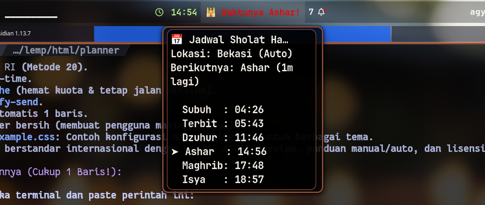

# 🕌 Waybar Prayer Times & Adzan Countdown

<p align="center">
  
  
  
  
</p>

A lightweight, zero-dependency prayer times countdown module for **Waybar** (Hyprland, Sway, River, Niri). Automatically detects your current location, calculates accurate prayer schedules (including Indonesian **Kemenag RI** standard), shows real-time countdowns, and alerts you when Adzan arrives.

---

## ✨ Features

- 📍 **Auto Geolocation:** Automatically detects your city and coordinates via IP. Travel anywhere, and your prayer schedule updates seamlessly!
- ⏳ **Real-Time Countdown:** Displays the next prayer and minutes/hours remaining directly on your bar (e.g. `🕌 Ashar -25m`).
- 🕌 **Kemenag RI Accurate:** Uses Method 20 (Kementerian Agama RI) calculation by default for precise Indonesian prayer times.
- 💾 **Smart Caching:** Fetches schedule only once per day and caches it locally (`~/.cache`). Works completely offline!
- 🔔 **Adzan Desktop Alerts:** Sends desktop notifications via `notify-send` / SwayNC when prayer time arrives.
- 🎨 **Adaptive Styling:** Changes visual states (normal → warning `< 15m` → adzan alert).
- 🖱️ **Interactive:** Click to view full schedule popup notification; right-click to force refresh location.
- ⚡ **Zero External Dependencies:** Built with pure Python 3 standard library.

---

## 🖥️ Preview

<p align="center">
  
</p>

<p align="center">
  
</p>

---

## 🚀 Quick Install (1-Line Command)

Run this single command in your terminal:

```bash
curl -sSL https://raw.githubusercontent.com/kisworo/waybar-prayer-times/main/install.sh | bash
```

> **Note:** The installer places the binary in `~/.local/bin/waybar-prayer-times` and automatically configures your Waybar.

---

## 🛠️ Manual Installation

If you prefer to install manually:

1. **Clone the repository:**
   ```bash
   git clone https://github.com/kisworo/waybar-prayer-times.git
   cd waybar-prayer-times
   ```

2. **Copy the script to your PATH:**
   ```bash
   mkdir -p ~/.local/bin
   cp prayer_times.py ~/.local/bin/waybar-prayer-times
   chmod +x ~/.local/bin/waybar-prayer-times
   ```

3. **Add module to Waybar config (`~/.config/waybar/config` or `config.jsonc`):**
   ```jsonc
   "modules-center": [
       "clock",
       "custom/prayer"
   ],

   "custom/prayer": {
       "format": "{}",
       "exec": "$HOME/.local/bin/waybar-prayer-times",
       "interval": 60,
       "return-type": "json",
       "on-click": "$HOME/.local/bin/waybar-prayer-times --notify",
       "on-click-right": "$HOME/.local/bin/waybar-prayer-times --force",
       "tooltip": true
   }
   ```

4. **Add CSS styles to `~/.config/waybar/style.css`:**
   ```css
   #custom-prayer {
       padding: 0 8px;
       font-weight: bold;
   }
   #custom-prayer.warning {
       color: #ff9e64; /* Warning color when < 15 mins */
   }
   #custom-prayer.adzan {
       color: #ff5555; /* Alert color during adzan */
   }
   ```

5. **Restart Waybar:**
   ```bash
   killall waybar && waybar &
   ```

---

## ⚙️ Configuration (Optional)

By default, the script detects your location automatically. If you want to lock it to a specific city (e.g. if using a VPN), create a config file at `~/.config/waybar-prayer.conf`:

```ini
# ~/.config/waybar-prayer.conf

# Lock to a specific city (default: auto)
city = Bandung

# Calculation method (default: 20 for Kemenag RI)
# 1 = Muslim World League, 2 = ISNA, 3 = Egypt, 4 = Makkah, 20 = Kemenag RI
method = 20
```

---

## ⌨️ CLI Usage

You can also run the script directly from your terminal:

```bash
# Print today's schedule table in terminal
waybar-prayer-times --list

# Trigger a desktop notification
waybar-prayer-times --notify

# Force refresh data from API
waybar-prayer-times --force

# Check prayer times for a specific city
waybar-prayer-times --city Surabaya --list
```

---

## 🗑️ Uninstallation

To remove the module and scripts:
```bash
curl -sSL https://raw.githubusercontent.com/kisworo/waybar-prayer-times/main/uninstall.sh | bash
```

---

## 🤝 Contributing

Contributions, issues, and feature requests are welcome! Feel free to check the [issues page](https://github.com/kisworo/waybar-prayer-times/issues).

## 📄 License

Distributed under the [MIT License](LICENSE). Copyright (c) 2026 **Kisworo**.
